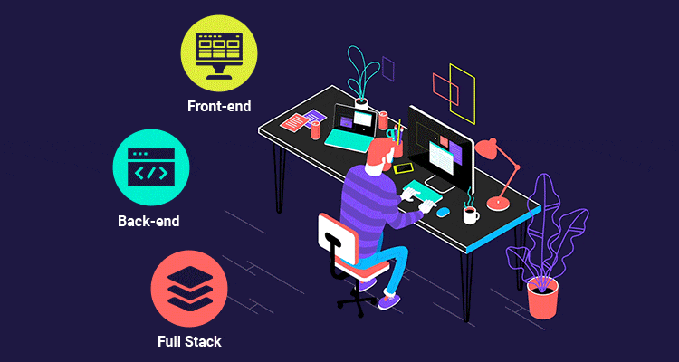
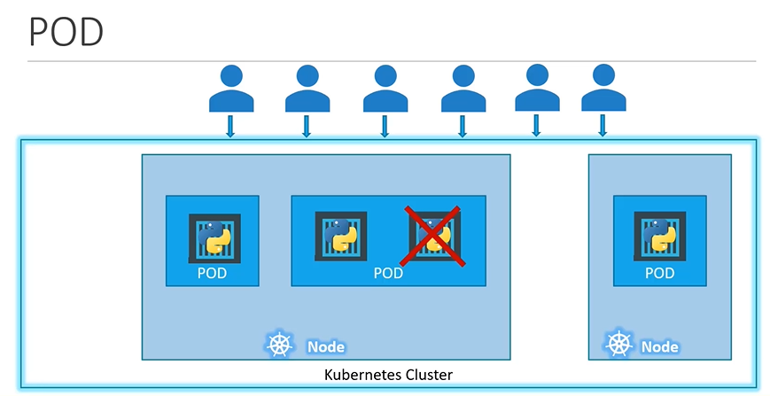

# Getting Started with Kubernetes - 


- Kubernetes(k8s), also known as `K8s`, is an open-source system built by Google based on there experience running containers in production for automating deployment, scaling, and management of containerized applications.

>[!IMPORTANT]
> Kubernetes(k8s) is a Open Source Container Orchestration Tool that automates the management, scaling and deployment of containerized applications.

- It is now an Open-Source Project and is arguably one of the best and most popular Container Orchestration technologies out there.
- To understand Kubernetes, we must understand 2 things (You can find info on this in Docker Tutorial):
  - Container
  - Orchestration


- Kubernetes is just a container orchestration technology. There are multiple such technologies available today. Docker has it's own tool called Docker Swarm, Kubernetes from Google and MESOS from Apache. While Docker swarm is really easy to setup and get started, it lacks some of the advanced features required for complex applications. MESOS on the other hand si quite difficult to setup and get started but supports many advanced features.

- Kubernetes arguably the most popular of all , is a bit difficult to setup and get started but provides a lot of options to customize deployments and supports deployment of complex architectures.

- It is now supported on all public cloud service providers like GCP, Azure and AWS. It is also one of the top most ranked projects on Github.

- There are various advantages of container orchestration:

  - The application is now highly available as hardware failures do not bring our application down because we have multiple instances of our application running on different nodes i.e. high application availability and no downtime.

  - The user traffic is load balanced across various containers. When demand increases, deploy more instances of the application seamlessly and within a matter of seconds, and we have the ability to do that at a service level when we run out of hardware resources, scale the number of underlying hosts up or down without having to take down the application and do all of these easily with a set of declarative object configuration files.

  - Disaster Recovery is easy as well. If a node goes down, the application is automatically moved to another node. The application is also automatically restarted if it crashes.

# Kubernetes Architecture

  

  ```mermaid
  graph TD
      subgraph Master_Node["Master Node"]
          APIServer["API Server"] 
          Scheduler["Scheduler"] 
          ControllerManager["Controller Manager"] 
          etcd["etcd"]
      end

      subgraph Worker_Node_1["Worker Node"]
          kubelet1["kubelet"] 
          kubeproxy1["kube-proxy"] 
          pod1["Pod 1"]
          pod2["Pod 2"]
      end
      
      subgraph Worker_Node_2["Worker Node"]
          kubelet2["kubelet"] 
          kubeproxy2["kube-proxy"] 
          pod3["Pod 3"]
          pod4["Pod 4"]
      end

      subgraph Worker_Node_3["Worker Node"]
          kubelet3["kubelet"] 
          kubeproxy3["kube-proxy"] 
          pod5["Pod 5"]
          pod6["Pod 6"]
      end

      %% Connections
      APIServer --> Scheduler
      APIServer --> ControllerManager
      APIServer --> etcd

      APIServer --> kubelet1
      APIServer --> kubelet2
      APIServer --> kubelet3

      kubelet1 --> pod1
      kubelet1 --> pod2
      kubelet2 --> pod3
      kubelet2 --> pod4
      kubelet3 --> pod5
      kubelet3 --> pod6

      kubeproxy1 --> pod1
      kubeproxy1 --> pod2
      kubeproxy2 --> pod3
      kubeproxy2 --> pod4
      kubeproxy3 --> pod5
      kubeproxy3 --> pod6
  ```

## Node

- A `Node` is a machine, physical or virtual on which Kubernetes is installed. A node is a worker machine and that is where container will be launched by Kubernetes.

- Previously, it was also known as `Minions`. Sometimes you might hear this term being used interchangeably.

- But what if the node on which our application is running fails?? Well Obviously our application goes down. So, you need to have more than one nodes.

- A Cluster is a set of nodes grouped together. This way even if one node fails, we have our application still accessible from other nodes.

- Moreover having multiple nodes helps in sharing loads as well.

## Master

- Now, we have the cluster but who is responsible for managing the cluster. Where is the information about members of cluster stored? How are the nodes monitored? When a node fails how do you move the workload of the field node to another worker node?

- That's where the master comes in.

- The `Master` is another node with Kubernetes installed on it and is configured as master. The master watches over the nodes in the cluster andd is responsible for actual orchestration of containers on the worker nodes.

## Components

- When we install kubernetes on a system, we are actually installing a number of components such as an

  - API Server
  - ETCD Service
  - Kubelet service
  - Virtual Network
  - Container Runtime
  - Controllers
  - Schedulers
  
- API Server:

  - The API Server acts as the Front-end of Kubernetes Service.

  - It is the entry point into the Kubernetes Cluster.

  - The Users, Management Devices, CLI all talk to the API Server to interact with Kubernetes Cluster.

- ETCD Key-Value Store:

  - ETCD is a distributed reliable key-value store used by Kubernetes to store all data used to manage the cluster.

  - Think of this way when we have multiple nodes and multiple masters in our cluster, ETCD stores all that information on all the nodes in the cluster in a distributed manner.

  - It is responsible for implementing blocks within the cluster to ensure that there are no conflict b/w masters.

- Scheduler:

  - The Scheduler is responsible for distributing work or containers across multiple nodes.

  - It looks for newly created containers and assigns them to nodes.

- Controllers:

  - Controllers are the brain behind the orchestration

  - Responsible for noticing and responding when nodes, endpoints or containers goes down. They make the decisions to bring up new containers in such cases.

- Virtual Network:

  - The Virtual Network turns all the nodes inside the cluster into a powerful machine.

- Container Runtime:

  - Container Runtime is the underlying software that is used to run containers.

  - In our cases this happens to be docker let's suppose it for now as there are other options as well.

- Kubelet

  - Kubelet is the agent that runs on each node in the cluster.

  - The agent is responsible for making sure that containers are running on the nodes as expected.

<hr>

## Master vs Worker Nodes

- So, far we have seen 2 types of Servers:

  - Master
  - Worker
  - Set of Components

- They all together make Kubernetes.

- But how are these components distributed across different types of server?? In other words, how a server becomes master and the other become slave?

- The `Worker` Node or `Minion` as it is also known is where the containers are hosted.

- The `Worker` nodes have `Container Runtime`.

- For example, docker containers are needed to run docker container on a system, we need container runtime installed and that's where container runtime falls. In this case it happens to be docker. This doesn't have to be docker only. There are other container runtime alternatives available such as Rocket or Cryo. For this complete tutorial guide, we will suppose docker as our Container Runtime.

- The `Master` Server has the `KubeAPI Server` and that is what makes it a master.

- Similarly, the `Worker` nodes have the `Kubelet Agent` that is responsible for interacting with a master, to provide health information of the worker node and carry out action requested by Master on the worker nodes.

- All the information gathered are stored in a `key-value store` on the `master`. It is based on most popular ETCD Framework.

- The `Master` also has the `Scheduler` and the `Controller`.

## KubeCtl

- In parallel, let's not forget about one of the command line utilities Known as `Kube Command Line Tool` or `KubeCtl` or `Kube Control` as it is also called.

- The `KubeCtl` tool is used to deploy and manage applications on a Kubernetes Cluster.

- To get Cluster Information, to get status of other nodes in the cluster and to manage many other things.

- The `kubectl run` command is used to deploy an application on the cluster.

- The `kubectl cluster-info` command is used to view information about the cluster.

- The `kubectl get nodes` command is used to get list of all the nodes that are part of the cluster.

# Setting up Kubernetes

- There are multiple ways to setup Kubernetes. We can set it up ourselves locally on our laptops or virtual machines using solutions like :
  - minikube
  - microK8s
  - Kudeadm.

- The KubeAdmin tool is used to bootstrap and manage production grade kubernetes clusters.

- There are also hosted solutions available for Setting Up Kubernetes in cloud environment such as:

  - 
  - 
  - 
  - 

## MiniKube

- Earlier we talked about different components of Kubernetes that make up master and worker node, such as the API Server, Key-Value Store, Controllers, Scheduler on the `Master` and the Container Runtime, KubeCtl Agent or Kubelet Service on the `Worker Node/Minion`.

- It takes a lot of time and effort to setup and install all of these various components systems individually by ourselves.

- MiniKube Bundles all of these different component into single image, providing us a pre-configured single node, kubernetes cluster, so we can get started in a matter of minutes.

- The Whole bundle is packaged into an ISO image and is available online for download.
- MiniKube provides an executable command line utility that automatically download the ISO and deploy it in a virtualization platform such as ,  and 

- So, you must have a hypervisor installed on your system.

- For Windows, we can use VirtualBox or Hyper-V and for Linux, VirtualBox or KVM.

- And finally to interact with Kubernetes , you must have the KubeCtl Kubernetes command Line Tool also installed on your machine.

# Kubernetes Concept


- Before we head into understanding PODs, we expect you to have some basic concepts of:

  - Docker
  - Kubernetes Theory

- We are assuming that the following has already been setup.

  - We assume that the application is already daeveloped and built into Docker Image and is avaialable on a Docker Repository like Docker Hub, so that kubernetes can pull it down.

  - We also assume that the Kubernetes Cluster has already been setup and is working.

  - This could be a single-node or multi-node setup doesn't matter.

  - All the services need to be in running state.

## PODs

- As we discussed before with Kubernetes, Our ultimate aim is to deploy our application in the form of containers on a set of machines that are configured as worker nodes in cluster.

- However, Kubernetes does not deploy containers directly on the Worker Nodes.

- The Containers are encapsulated into Kubernetes Objects called `PODs`.

- A POD is a single instance of an application.

- A POD is the smallest Object you can create in Kubernetes.

- Each `POD` is assigned it's own internal IP Address, by which it communicates with other containers in the cluster.

- Every time a POD dies, it's IP Address changes.

- Pods are the smallest deployable units of computing that you can create and manage in Kubernetes.


- Let's assume a simple case where we have a single node, Kubernetes Cluster with a single instance of our application running in a single docker container encapsulated in a POD. What if the number of users accessing my application increase and we need to scale our application, we need to add additional instances of our web application to share the load.

  - Now, where would we spin up additional instance??

  - Do we bring up new container instance within same POD?? Now, we create new POD all together with a new instance of the same application. As we can see now we have 2 instances of our web application running on seperate PODs on the same Kubernetes System or Node.

  - What if the use base further increases more and our current node has no sufficient capaciyy ? Well, than we can always deploy additional PODs on a new node in the cluster. We will have a new node added to the cluster to extend the cluster's physical capacity.

  - So, the conclusion we get from the above example we discussed is that, `PODs` usually have a `1-to-1 relationship with containers` running our application. To scale up we create new `PODs` and to scale down you delete existing `PODs`. We do not add additional containers to an existing POD to scale up our application.

  

### Multi-Container PODs

- We just mentioned that PODs usually have 1-to-1 relationship with the containers. But are we restricted to have single container in a single POD?

  - No, A single POD can have multiple containers except for the fact that they are not usually multiple containers of the same kind. But sometimes we may have a scenario where we have a helper container that might be doing some kind of supporting task for our web application, such as processing a user, entering data, processing a file uploaded byt the user etc, and you want these helper containers to live alongside our application container. In that case we can have both the containers part of the same POD, so that when a new application container is created, the helper is also created, and when it dies the helper also dies, since they are part of the same POD.

  - The 2 containers can also communicate with each other directly by referring to each other as local hosts since they share the same network space. They can also share the same storage space as well.

# `kubectl`

## `kubectl run name --image=image_name`

- Earlier we learned about the `kubectl run name --image=image_name` command.

  - What this command really does is deploys a Docker container fo specified image by creating a POD.

  - It first creates a POD and automatically deploys an instance of the specified docker image. Assume this to be nginx for now.

- But where does it get the application image form?

  - For that we need to specify the image name using `--image` option as shown in given example:

    - `kubectl run nginx --image=nginx`

  - In the example, above the image is downloaded form the docker hub repository.

## `kubectl get pods`

- The command help us see the list of PODs in the cluster.

- `-o wide` parameter additional information in a minimalistic way.

## `kubectl describe pod POD_NAME`

- This command provides a lot of information  as compared to the get command.

- This command shows some major details like POD_NAME, LABELS, START_TIME, POD_IP_ADDRESS and node assigned to along with the IP Address of the node.

- It also displays information related to the container, Image and Container_ID.

- At the bottom we can see the additional information called events, here we can see the list of events that occurred since the POD was created. A POD goes through multiple stages before it starts.

- The POD is assigned a node. If there are multiple nodes , we would see which node the port was assigned to.

## `kubectl delete pod POD_NAME`

- This command deletes the existing POD with the specified name.

## POD with YAML

- Kubernetes uses YAML files as input for the creation of objects such as PODs, Replicas, Deployment Services, etc. All of these follow similar structure.

- Kubernetes definition file always contain 4 top level fields.

  - `apiVersion`
  - `kind`
  - `metadta`
  - `spec`

- These are the top-level or root level properties. These are also required fields, so we must have them in our configuration  file.

- Let's have a look at each of the top-level fields one by one.

  - `apiVersion`

    - This is the version of the Kubernetes API, we are using to create objects.

    - Depending on what we are trying to create we must use the right `apiVersion`.

    - For now as we are working on PODs we will set the `apiVersion` as `v1`.

    - Some other possible values for `apiVersion` are:

      - For PODs: v1
      - For Service: v1
      - ReplicaSet: apps/v1
      - Deployment: apps/v1

  - `kind`

    - The kind refers to the type of object we are trying to create.

    - For our case, the kind is Pod.

    - Some other possible values for this `kind` are:

      - Pod
      - ReplicaSet
      - deployment
      - service

  - `metadata`

    - The `metadata` is the data about the object like it's name, label etc.

    - As we can see unlike the first two where we have specified string value, this is in the form of a dictionary.

    - Under `metadata`, `name` is a string value.

    - The `labels` in metadata is a dictionary and it can have any key-value pair as we wish.

    - For example let's assume, there are 100s of PODs running a front-end application and 100s of PODs running a back-end application or a database. It will be difficult for us to group these parts once they are deployed. If we label them now as frontend, backend and database, we will be able to filter parts based on this label at a later point on time.

    - It's important to note that under `metadata` we can only specify names or labels or anything else that kubernetes expects to be under metadata. We cannot add any other property as we wish under this.

    - However under labels we can have we can have nay kind of key-vealu pairs as we see fit. So, it's important to understand what each of these parameters expect.

    - Example:

      ```YAML
        appVersion: v1
        kind: Pod

        metadata:
          name: my-app-pod
          labels: 
            app: myapp
            type: frontend

        spec:
      ```
  
  -`spec`
  
  - But til now we haven't specified any container or Image name which we need in the POD.

  - The last section in the file is the specification section known as `spec`.

  - Depending on the object we are going to create. This is where we would provide additional information to Kubernetes pertaining to that object.

  - This going to be different for different objects so it's important to understand or refer to the documentation to get the right format for each.

  - In our example, since we are creating a POD with single container in it, it is easy. Spec is a dictionary. So, add a property in it called containers.  `containers` here is a list or an array. The reason this property is a list is because the PODs can have multiple containers within them.

  - Example:

        ```YAML
          appVersion: v1
          kind: Pod

          metadata:
            name: my-app-pod
            labels: 
              app: myapp
              type: frontend

          spec:
            containers:
              - name: nginx-container
                image: nginx
        ```

- Once the file is created, run the command `kubectl create -f filename.yaml` and kubernetes creates the POD. `create` and `apply` can be used synonmously. 
