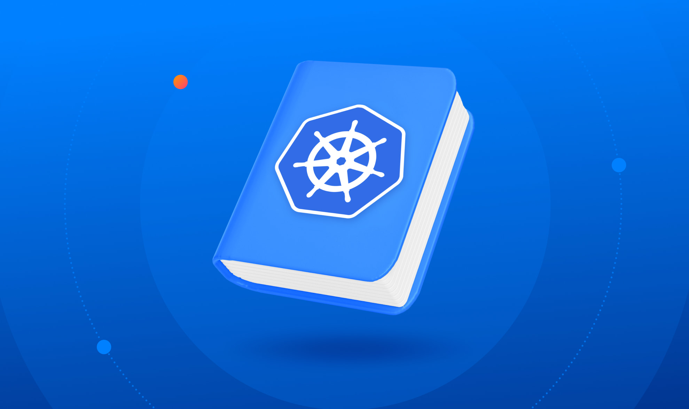

# Replication Controllers and Replica Set - 


- Controllers are the brain behind Kubernetes.

- They are the processes that monitor Kubernetes Objects and respond accordingly.

## What is `Replica`? And Why do we need a `Replication Controller`?

- Let's suppose our previous scenario where we had a Single POD running our application. What if for some reason our application crashes and the part fails? Users will no longer be able to access our application. To prevent users from losing access to our application, we would like to have more than 1 instance or POD running at the same time. That way if one fails, we still have our application running on the other one.

>[!IMPORTANT]
>The Replication Controller helps us run multiple instances of a Single POD in Kubernetes Cluster, thus providing high availability. So does that mean we can't use a Replication Controller if we plan to have a Single POD?

- No, even if we have a single POD, The Replication Controller can help by bringing up a new POD when the existing one fails. Thus the Replication Controller ensures that the specified number of PODs are running at all times, even if it's just 1 or 100.
  
- Another reason we need replication controller is to create multiple parts to share the load across them. For example, in a simple scenario where we have a single POD serving a set of users. When the number of users increase, we deploy additional POD to balance the load across 2 PODs.

- If the demand further increases and if we were to run out of resources on first node, we could deploy additional PODs across the other nodes in the cluster. As we can see the Replication Controller spans across multiple nodes in the cluster. It helps us balance the load across multiple parts on different nodes as well as scale our application when the demand increases.

- It's important to note that there are 2 similar terms:

  - Replication Controller
  - Replica Set

- Both have the same purpose, but they are not the same.

- Replication Controller is the older technology that is being replaced by Replica Set.

- Replica Set is the new recommended way to setup replication.

- However, whatever we discussed till now in this article remain applicable to both these technologies.

- There are minor differences in the way each work.

### Creating `Replication Controller`

- rc-definition.yml

    ```YAML

        apiVersion: v1
        kind: ReplicationController
        metadata:
            name: myapp-rc
            labels:
                app: myapp
                type: front-end

        spec:
            template:
                metadata:
                    name: my-app-pod
                    labels: 
                        app: myapp
                        type: frontend

                spec:
                    containers:
                      - name: nginx-container
                        image: nginx
            replicas: 3

    ```

- As with any other kubernetes file we have 4 sections. As we are creating a Replication Controller, it is supported in `apiVersion` `v1`. The `kind` is `ReplicationController`. Under metadata, we will add the name and we will also add a few labels => app and type and assign value to them.

- The next is the most crucial part of the definition file that is the specification.

- For any Kubernetes definition file, the spec section defines what's inside the object we are creating. In this case, we know that the replication controller creates multiple instances of a POD. But what POD?

- We create a template section under spec to provide a POD template to be used by the replication controller to create replicas.

- Now how do we define the POD template? Remember we created a POD definition file in the previous exercise. We can reuse the contents of the file to populate the template section.

- Move all the contents od the POD definition file into the template section of the Replication Controller except for the first few lines which are apiVersion an kind.

- Remember whatever we move must be under the template section, meaning they should be properly intended to the right and have more spaces before them than the template line itself. They should be children of the template section.

- Looking at our file now, we now have 2 metadata sections. One is for the replication controller and another for the POD and we have 2 aspects section one for each. We have nested 2 definition files together. The Replication Controller being the parent and the POD Definition being the child.

- Till now we haven't mentioned how many replicas we need in the replication controller. For that add another property to the spec called replicas and input the number of replicas you need under it. Remember that the template and the replicas are direct children of spec sections, so they are siblings and must be on same vertical line, which means having equal number of spaces before them.

- Once the file is ready run the `kubectl create` command and input the file using `-f` parameter as follows:

  - `kubectl create -f rc-definition.yml`

- The Replication Controller is created. Now as soon as it gets created, it first creates the POD using POD definition template as many as required as mentioned.

- To view the list of created replication controllers, use the `kubectl get replicationcontroller` command and we will see the replication controller listed. We can also see the desired number of replicas or PODs, the current number of replicas and how many of them are ready in output.

- If we would like to see the PODs that were created by the replication controller run the `kubectl get pods` command and we cann see, 3 PODs running as mentioned in the example.

- Note that all of them are starting with the name of the replication controller `myapp-rc` indicating they are automatically created by the replication controller.

## Replica Set


- It is very similar to replication controller.
- replicaset-definition.yml

  ```YAML
    apiVersion: apps/v1
    kind: ReplicaSet
    metadata:
      name: myapp-replica
      labels:
        app: myapp
        type: frontend

    spec:
            template:
                metadata:
                    name: my-app-pod
                    labels: 
                        app: myapp
                        type: frontend

                spec:
                    containers:
                      - name: nginx-container
                        image: nginx
            replicas: 3
            selector:
              matchLabels:
                type: fornt-end
  ```

- We have a base structure very similar to replication controller. But there are some difference we will look into as we slowly dive deep into this. So, the `apiVersion` for this is `apps/v1` which is different for Replication controller i.e. `v1`. The `kind` is `ReplicaSet` and as usual we add name and labels in the metadata. The Specification looks very similar to Replication Controller. It has a template section where we provide POD definition and replicas as well.

- However there is one major difference between ReplicaSet and ReplicationController. ReplicaSet requires a `selector` definition. The `selector` section helps the replica set identify what PODs fall under it.

- But why we need to specify what PODs fall under it? If we have provided the contents of POD definition file itself in the template.

  - It's because replica set can also manage PODs that were not created as a part of the Replica Set creation.

  - Say for example the PODs created before the creation of the ReplicaSet that match labels specified in the selector. The ReplicaSet will also take those POD into consideration when creating the replicas.

  - But, remember the fact that the `selector` is one of the major differences b/w ReplicationController and ReplicaSet. The `selector` is not a required field in case of replication controller, but is still available. In case if you don't mention it in the ReplicationController it assumes it to be same as the labels provided in the POD definition file.

  - In case of replica set a user input is required for this property and it has to be written in the form of `matchLabels` as mentioned. The `matchLabels` selector simply matches the labels specified under it to the labels on the POD. The ReplicaSet Selector also provides many other options for matching labels that were not available in a Replication Controller.

  - To create the ReplicaSet, use the command:

    - `kubectl create -f replicaset-definition.yml`

  - To see the created replicas, use the `kubectl get replicaset` command to get list of PODs.

## Labels and Selectors in PODs



- So, sometimes this question might be hitting you, why do we label our PODs and Objects in Kubernetes??

- Let's understand this with a simple scenario.

  - Say we deployed three instances of our frontend web application as 3 PODs. We would like to create a replication controller or replica set to ensure that we have three active PODs at any time. This is one of the use case of replica sets. We can use it to monitor existing PODs if we have them already created as we consider for this example. In case they were not created, the replica set will create them for us. The role of the replica set is to monitor the parts and if any of them were to fail, deploy new ones. The Replica Set is in fact a process that monitors the PODs. Now, how does the replica set know what PODs to monitor? There could be hundres of other PODs in the cluster running different applications. This is where labeling our PODs during creation comes in handy. We could now provide these labels as a filter for replica set. Under the selector section we use the match labels filter and provide the same label that we used while creating the PODs. This way the replica set knows which PODs to monitor.

  - Same concept of Labels and Selectors is used in many places throughout the Kubernetes.

## Scaling the Replica Set

- Let's say we started with 3 Replicas and in future after sometime we decide to scale it to 6. How do we update our ReplicaSet to scale to 6 replicas. Well there are multiple ways to do it. The first way to do it is update the number of replicas in the definition file to 6. Than run the `kubectl replace -f replicaset-definition.yml` command and this will update the replica set to have 6 replicas.

- The second way to do it is run the `kubectl scale --replicas=6 -f replicaset-definition.yml` command and this will update the replica set to have 6 replicas. We can either input the definition file or provide replica set in type name format as follows: `kubectl scale --replicas=6 [type] [name]`. However, using file name is less preferred as it will not result in number of replicas updated automatically in the file. In other words, the number of replicas in replica set definition file will still be 3. Even though you scaled your replica set to have 6 replicas using the `kubectl scale --replicas=6 -f replicaset myapp-replicaset` command.

- There are also options available to automatically scale the replica set based on load as well which we will discuss in some other lesson further.

- If in case we want to delete an existing ReplicaSet, use the command `kubectl delete [type] [name]` command.
