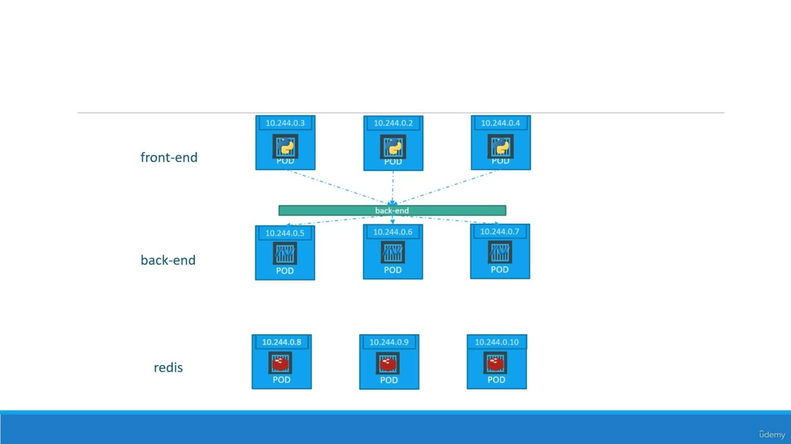

# Deployments - 


<br>

>[!IMPORTANT]
>Deployments manages a set of PODs to run an application workload for stateless applications.

- For now let us forget about PODs and Replica Sets and other Kubernetes Concept and discuss about how you might want to deploy  your application  in a production environment.

- Say, for example we have a web server that needs to be deployed in a production environment. We need not one but many such instances of the web server running for obvious reasons.

- Secondly, whenever newer versions of application builds become available on the docker registry , we would like to upgrade our docker instances seamlessly.

>[!WARNING]
>However when we upgrade our instances we donot want to upgrade all of them at once as this might impact users accessing our applications so you might want to upgrade them one after the other and that kind of update is know as Rolling Updates.

- Suppose one of the upgrades we performed resulted in an unexpected error and you are asked to undo the recent change, you would like to be able to roll back the changes that were recently carried out.

- Finally, say for example you would like to make multiple changes to your environment such as upgrading the underlying web server versions as well as scaling our environment and also modifying the resource allocations etc.

- We donot want to apply each change immediately after the command is run, instead we would like to apply a pause to our environment, make the changes and then resumes so that all the changes are rolled out together. All of these capabilities are available with the Kubernetes deployments.

- Throughout this tutorial guide we discussed about PODs which deploy single instances of our application such as the web application in this case. Each container is encapsulated in PODs. Multiple such PODs are deployed using replication controllers or replica set and then comes deployment which is a Kubernetes Object that comes higher in the hierarchy, the deployment provides us with the capability to upgrade ht e underlying instances seamlessly using rolling updates, undo changes and pause and resume changes as required.

### Creating Deployment

  ```YAML
   apiVersion: apps/v1
   kind: Deployment
   metadata:
        name: myapp-deployment
        labels:
            app: myapp
            type: front-end
    spec:
        template:
            metadata:
                name: myapp-pod
                labels:
                    app: myapp
                    type: front-end
            spec:
                containers:
                    - name: nginx-container
                      image: nginx
        replicas: 3
        selector:
            matchLabels:
                type: front-end

  ```

- As with the previous component, we first create the deployment definition file, the contents of the deployment definition file are exactly similar to the replica set definition file, except for the `kind` which is now set to be `Deployment`. The `apiVersion` is set to `apps/v1`. `metadata` which has names and labels and `spec` that has a `template`, `replicas` and `selector`.

- The `template` has a POD definition inside it. Once the file is ready run the `kubectl create -f deployment-definition.yml` command. Then run the `kubectl get deployment` command to see newly created deployment. The deployment automatically creates a replica set. If we run the `kubectl get replicaset` command we will be able to see a new replica set in the name of deployment. The Replica Set ultimately creates PODs. So, if we run the `kubectl get pods` command , we will be able to see POD name with the name of deployment and the replica set.

- So far there hasn't been much of a difference b/w replica set and the deployments except for the fact that deployment created a new Kubernetes object called deployments.

>[!WARNING]
>Database can't be replicated using Deplyment, cause they are not stateless, and actually has a state, meaning if we have clones or replicas of database, they will all have to access the same Data Storage.<br/><br/>
> And, hence would require a mechanism that manages which PODs are currently writing to that storage or which PODs are reading from the storage, to avoid data inconsistencies.

  And here comes another Kubernetes Object called `StatefulSet` which is used to manage stateful applications like databases.

## StatefulSets

- Just like `Deployments` are used to manage stateless applications, `StatefulSets` are used to manage stateful applications.

- It is used to manage stateful applications like databases, where each POD has a unique identity and persistent storage.

- The PODs in a StatefulSet are created in a sequential order and each POD has a unique identity.

- The Updates to the PODs in a StatefulSet are carried out in a sequential order so as to avoid redundancy, and maintain data consistency.

- But, it is a fact that deploying a StatefulSet is more complex than deploying a Deployment. That's why it's common practice to setup databases outside of the Kubernetes Cluster, and only deploy the scalable parts of the application inside the Kubernetes Cluster.

# Kubernetes Networking


- We will start with a single node Kubernetes Cluster. The node has an IP Address. Say it is one 192.160.8.1.2. in this case, this is the IP address we use to access the Kubernetes node, SSh into it etc..

- On a side note remember if we are using a minikube setup , then we are talking about the IP Address of the miniKube Virtual Machine inside your hypervisor.

- So, on the single node Kubernetes Cluster, we have created a single POD. As you know, a POD hosts a container, unlike in the Docker World where an IP address is always assigned to a docker container. In Kubernetes World IP Address is assigned to a POD. Each POD in the Kubernetes gets it's own internal IP Addresses. In our case, assume it to be in the range 10.244 series and the IP assigned to the POD is 10.244.0.2. So how is it getting this IP address??

- When Kubernetes is initially configured. We create an internal private network with the address 10.244.0.0 and all the PODs are attached to it. When we deploy multiple PODs they all get a separate ID assigned from this network. The PODs can communicate to each other through this IP, but accessing the other PODs using this internal IP address may not be a good idea as it is subject to change when PODs are recreated.

## Cluster Networking

- So it's all easy and simple to understand when it comes to networking on a single node. But how does it work when we have multiple nodes in the cluster.

- Let's assume 2 nodes having Kubernetes and they have IP addresses 192.168.1.2 and 192.168.1.3 assigned to them. Keep a note that they are npt the part of the cluster yet. Each of them has a single part deployed. This PODs are attached to an internal network and they have there own IP addresses assigned. However if we look at the internal network addresses we can see that they are the same. The two networks have an address 10.244.0.0 and the paths deployed have the same address too. This is not going to work well when the nodes are part of the same cluster, the PODs have the same IP Address assigned to them and that will lead to IP conflicts in the network. Now that's one problem. When a Kubernetes Cluster is setup, Kubernetes does not automatically setup any kind of networking to handle these issues. As a matter of fact, Kubernetes expects us to set up networking to meet certain fundamental requirements.

  Some of these are that

  - All containers/PODs in a Kubernetes Cluster must be able to communicate with one another without having to configure NAT.

  - All nodes must be able to communicate with containers and all containers must be able to communicate with the nodes in the cluster.

  - Kubernetes expects us to setup a networking solution that meets these criteria.

- Fortunately, we don't have to set it up all on our own as there are multiple pre-built solutions available. Some of them are:

  - 
  - 
  - 
  - 
  - etc...

- This depends on the platform we deploying the our Kubernetes Cluster on. We may use one of these solutions.

- For example, if we were setting up a Kubernetes Cluster from scratch on our own system, we may use any of the solutions like calcio or flannel etc. If we were deploying on a vmware environment, NSXT may be a good option.

- So, back to our cluster with custom networking either flannel or calico setup. It now manages the networks and IPs in my notes and assigns a different network address for each network in the node. This creates a virtual network of all PODs and nodes where they are all assigned a unique IP Address and by using simple routing techniques, the cluster networking enables communication between the different PODs or nodes to meet the networking requirements of Kubernetes. Thus all the PODs now can communicate to each other using the assigned IP Address.

## Services

>[!IMPORTANT]
>Services is an abstracton that defines logical set of PODs and policies for the PODs to communicate together.

- Kubernetes Services enable communication between various components within and outside of the application.

- It assigns a static IP Address and DNS name to a set of PODs and enables connectivity to them.

- Lifecycle of POD and Services are independent of each other. PODs can be created, deleted, scaled etc. without affecting the services.

- Kubernetes Services help us connect applications together with other applications or users. For example: Our application has groups of PODs running various sections such as a group for serving a front end loads to users and other group for running back end  processes and a third group connecting to an external data source. It is services that enable connectivity b/w these groups of PODs.

- Services enable the front-end application to be made available to end users. It helps communication b/w backend and frontend PODs and helps in establishing connectivity to an external data source.

- Thus services enable loose coupling b/w microservice in our application.

- Let's take a look at one use case of services. So far e talked about how PODs communicate with each other through internal networking. For now let's start with external communication. So, we deployed our pod having a web application running on it.How do we as an external user access the web page? First of all let's have a look on the setup. The Kubernetes node has an IP address 192.168.1.2. My laptop is on the same network as well, so it has an IP Address 192.168.1.10. The Internal POD network is in the range 10.244.0.0 and the port has an IP 10.244.0.2. Clearly, I cannot ping or access the port at address 10.244.0.2 as it's on  a separate network. So, what are the options to see the web page.

- First if we were to search into the Kubernetes node at 198.168.1.2 from the node we would be able to access the PODs webpage by doing a curl or if the node has a GUI, we would fire up a browser and see the web page in a browser following the address `http://10.244.0.2`. But this is from inside the Kubernetes node and that's not what I really want. I want to be able to access the web server from my own laptop without having to SSH into the node and simply by accessing the IP address of the Kubernetes node. So, we need something in the middle  to help us map requests to the node from our laptop through the node to the POD running the web container. This is where Kubernetes Services come into play. The Kubernetes service is an object just like PODs in replica set or deployments that we worked with before.

- Types of Kubernetes services:

  - `NodePort`
  - `ClusterIP`
  - `LoadBalancer`

<hr/>

### ConfigMap

>[!IMPORTANT]
>ConfigMap is a Kubernetes Object that stores configuration data in key-value pairs.

- It is nothing but external configuration data that can be consumed by the application.
- It mainly contains configurations like DB_URL, API_URL, environment variables etc.

- Example of ConfigMap Implementation:

  `ConfigMap.yml`

  ```YAML
    apiVersion: v1
    kind: ConfigMap
    metadata:
      name: my-app-config
    data:
      DB_URL: "mysql://db-host:3306/my_database"
      DB_USERNAME: "db_user"
      DB_PASSWORD: "supersecretpassword"
  ```

  `pod.yaml`

  ```yml
  apiVersion: v1
  kind: Pod
  metadata:
    name: my-app-pod
  spec:
    containers:
      - name: my-app-container
        image: my-app-image:latest
        env:
          - name: DB_URL
            valueFrom:
              configMapKeyRef:
                name: my-app-config
                key: DB_URL
          - name: DB_USERNAME
            valueFrom:
              configMapKeyRef:
                name: my-app-config
                key: DB_USERNAME
          - name: DB_PASSWORD
            valueFrom:
              configMapKeyRef:
                name: my-app-config
                key: DB_PASSWORD
  ```

  But, as shown above it is not recommended to use ConfigMap for sensitive data like passwords, API keys etc. For that we have `Secrets`.

### Secrets

>[!IMPORTANT]
>Secrets is a Kubernetes Object that stores sensitive data like passwords, API keys etc.

- It is similar to ConfigMap but is used to store sensitive data.
- The data here is not stored in plain text but is base64 encoded.

>[!CAUTION]
>The Built-in security mechanism is not enabled by default. It is recommended to enable it before using Secrets.

<hr/>

### Services - NodePort

>[!IMPORTANT]
>One of it's use case is to listen to a port on the node and forward requests on that port to a port on the POD running the web application. This type of service is known as a NodePort Service because the service listens to a port on the node and forward requests to the POD.

- It makes an internal port accessible on a port on the node.

- We said that a service can help us by mapping a port on the node to a port on the port.

- Let's take a closer look at the service. If you look at it, there are three ports involved.

- The port on the port where the actual web server is running is 80(Target Port). And it is referred to as the target port, because that is where the services forwards. The request to the second port is the port on the service itself. It is simply referred to as the port. Remember, these terms are from the viewpoint of the service. The service is infact like a virtual server inside the node, inside the cluster, it has it's own IP Address, and that IP Address is called the Cluster IP of Service. And finally, we have the port on the node itself, which we use to access the web server externally, and that is known as the NodePort. As you can see, it is set to 30008. That is because the node ports can be in a valid range, which default is from 30000 to 32767.

  

- Let's now look at how to create the service, just like how we created a deployment replica set or POD in the past. We will use a definition file to create a service. The high level structure of the file remains the same as before. The `spec` as always is the defining part of the file that differes b/w different objects. Here in the `spec` section of service we have `type` and `ports`. The `type` refers to the type of service we are creating. As discussed before it can be ClusterIP, NodePort or LoadBalancer.

- In this case since we are creating a node port, we will set it as `nodeport`. The next part of specs is `ports`. This is where we input information regarding all the ports.

- The first `port` is the `targetPort` which we are right now setting to `80`. The next one is simply `port` which is a port on the service object and we will set that to 80 as well. The third is `nodePort` which we will set to `30008` or any number in the valid range. Remember out of these the only mandatory field is port.

- If we don't provide a `targetPort`, it is assumed to be as same as port and if we don't provide a nodePort, a free port in the valid range b/w 30000 and 32767 is automatically allocated.  Also note that ports is an array, note that `-` under the ports section that indicates the first element in the array. We can have multiple such port mappings within a single service.

- There is nothing in the file that connects the service to the POD. We have just simply specified the target port but we didn't mention the target port on which POD. There could be 100s of PODs with web services running on port 80. So, as we have seen this with replica set and others we will use labels and selectors to link these together. We know that the POD was created with a label, we need to bring that label into the service definition file. So we use `selector` property in the service section just like in replica set and deployment definition files. Under the selector provide a list of labels to identify the POD. For this refer to the POD definition file used to create the POD. Pull the labels from the POD definition file and place it under the selector section. This links the service to the POD.

- Once done create a service using the command:

  - `kubctl create -f service-definition.yml`

- To see the created service run the command `kubectl get services`, this lists the services, the cluster IP and mapped ports. The port on the node is set to 30008. That's the port specified in the definition file. We can now use this port to access the web service using curl or a web browser.

-
  services-definition.yml

  ```YAML
    apiVersion: v1
    kind: Service
    metadata: 
     name: myapp-service
     
    spec:
     type: NodePort
     ports:
      - targetPort: 80
        port: 80
        nodePort: 30008
     selector:
      app: myapp
      type: frontend
     
  ```

  - So, far we talked about a service mapped to a single POD, but that's not the case all the time. What do you do when you have multiple PODS ? In a production environment you have multiple instances of your application running for high availability and load balancing purposes. In this case we have multiple similar PODs running our web application. They all have the same labels with a key app and set to value of myapp. The same label is used as selector during the creation of the service. So, when the service is created, it looks for a matching POD with the label and finds `n` of them. The Service than automatically selects all the n PODs as endpoints to forward the external request coming from the user. We don't have to make any additional configuration to make this happen. And if you are wondering what algorithm it uses to balance the load across 3 different PODs, it uses a random algorithm. Thus the service acts as a Built in load balancer to distribute load across different PODs.


- When PODs are distributed across multiple nodes. We have the web application on PODs on separate nodes in the cluster. When we create a service without having to do any additional configuration, Kubernetes automatically creates a service that spans across all the nodes in the cluster and maps the target port to the same port on all the nodes in the cluster. This way we aca access the application using IP of any node in the cluster and using the same port number which in this case is 30008.

- Using the IP of any of these nodes we try to curl the same port and the same port is made available on all the nodes POD of the cluster.


<hr/>

## Services - ClusterIP



>[!IMPORTANT]
>The Service creates a virtual IP inside the cluster to enable communication b/w different services such as a set of frontend servers to a set of backend servers.

- A Full Stack web application typically has different kinds of PODs hosting different parts of an application.

- You may have a set of PODs running a frontend web server, another set of parts running a backend web server, a set of PODs running a Key Value store like Redis and another set of PODs maybe running a persistent database like MySQL.

- The Web Frontend servers need to communicate to the backend servers and the backend servers need to communicate to the database as well as the redis services etc.

- So what is the right way to establish connectivity b/w these services or tiers of my application?

- The PODs all have an IP Address assigned to them as we can see on the screen, but these IPs as we know are not static. These PODs can go down anytime and new PODs are created all the time. And so you cannot rely on these IP Addresses for internal communication b/w these application. Also, what if the first front end POD at 10.244.0.3 need to communicate to a backend service? Which of the three would it go to and who would make the this decision? A Kubernetes Service can help us group the PODs together and provide a single interface to access the PODs in the group.

- For example, a service created for backend PODs  will help group all the backend PODs together and provide a single interface for other PODs to access the service. The requests are forwarded to one of the PODs under the service randomly. Similarly, create additional services for Redis and allow the backend PODs to access the redis systems through the service. This enables us to easily and effectively deploy micro-services based application on Kubernetes Cluster. Each layer can now scale or move as required without impacting communication b/w various services.

- Each service gets an IP and name assigned to it inside the cluster and that is the name that should be used by other PODs to access the service. This type of service is known as `ClusterIP`.

- To create such a service as always use a definition file.

- In service-definition file, first we use the default template that we have as usual having `apiVersion`, `kind`, `metadata` and `spec`. The `apiVersion` is `v1`, `kind` is `service` and we will give a name to our service, we will name it `back-end`. Under `spec` we have `type` and `ports`. The type is `ClusterIP`.The `ClusterIP` is the default Service type in case it's not defined. So, even if we don't specify it, it will automatically assume  the type to be `ClusterIP`. Under `port` we have a `targetPort` and `port`. The `targetPort` is the port where the backend is exposed, which in this case is 80 and the port is where the service is exposed, which is 80 as well. To link the service to a set of ports we use selector. We will refer to the POD definition file and copy the labels from it and paste it onto our `selector` section and that should be it. We can now create the service using the `kubectl create -f service.definition.yml`. We can now create a ClusterIP address. The service can be accessed by other parts using the ClusterIP or the service name.

- pod-definition.yml
  
  ```YAML
    apiVersion: v1
    kind: pod

    metadata:
     name: myapp-pod
     labels: 

    spec:
     containers:
      - name: nginx-container
        image: nginx
     
  ```

- service-definition.yml
  
  ```YAML
    apiVersion: v1
    kind: Service
    metadata:
     name: back-end
    spec:
     type: ClusterIP
     ports:
      - targetPort: 80
        port: 80

     selector:
      app: myapp
      type: backend

  ```

<hr/>

## Services - Load Balancer

  

- It provisions a load balancer for our application in supported cloud providers.

- A good example for that would be to distribute load across the different web servers in your frontend tier.

- We have already seen the NodePort service that helps us make an external facing application available on a port on the workers node.

- So, let's turn our focus to the frontend applications, which are the voting app and result app. We are very well aware of the fact that these PODs are hosted on the worker nodes in a cluster. So, let's say we have 4 node cluster. And to make the applications accessible to the external users, we create service type of NodePort. Now the services with type NodePort help in receiving traffic on the ports, on the nodes and running the traffic to the respective PODs. But what URL we would give our end users to access the application?? We can access any of these 2 applications using IP of any of the nodes and the right port where the service is exposed on. So, there would be 4 IP and Port combinations for the voting app and 4 IP and port combination for the result app.

- So, note that even if your PODs are hosted only on 2 of the nodes, they will still be accessible on IPs of all the nodes in the cluster. Say the PODs for deploying the voting app are deployed on the nodes with IP 70 and 71. They would still be accessible on the ports of all the nodes in the cluster. So, that's how a service is configured.

- So, we would share these URLs to our users to access the application, but that's not what the end users want. They need a single URL, like for example `https://example-vote.com` or `https://example-result.com` to access the application. So, how do we achieve that. So, One way to achieve this is to create a new VM for load balancer purpose and install and configure a suitable load balancer on it like proxy, nginx etc.. then configure the load balancer to route traffic to the underlying nodes. Now setting all of that load balancing and then maintaining and managing that can be tedious task. However if we were on a supported Cloud Platform like GCP, Azure or AWS, We could leverage the native load balancer of that cloud platform. Kubernetes has support for integrating with the native load balancers of certain cloud providers and configuring that for us. So, all we need to do is to set `type` under `spec` to `LoadBalancer` for the frontend services. Now remember this only works with supported cloud platforms. So, if we set the type of service to load balancer in an unsupportive environment like VirtualBox or any other environments then it would have the same effect as setting it to NodePort where the services are exposed on a high end port on the nodes. There it won't do that any kind of external load baancer configuration.

- Example of Load Balancer Service:

  ```YAML
    apiVersion: v1
    kind: Service
    metadata:
     name: front-end
    spec:
     type: LoadBalancer
     ports:
      - targetPort: 80
        port: 80
     selector:
      app: myapp
      type: front-end
  ```

<hr>

## Volumes

>[!SUCCESS]
>Volumes are used to store data in a persistent manner in Kubernetes. They are used to make sure the data is available and stored safely even after the pod has restarted or the cluster has crashed.
  
### How to persist data using Volumes??

#### What's the need??

- Consider a case, where we have a MySQL Database, which the application uses. The Data gets added, updated in the database, but when we restart the POD all the changes we did are gone. Because, k8s doesn't give you data persistence out of the box, that something we have to explicitly configure as a developer or user for each application, that needs saving data when pod restarts.

  So, basically we need a storage that doesn't depend on POD lifecycle, so it will still be there when pod dies and new ones get created, so it can pick up where the last POD left off.

- The data stored in a volume is preserved across POD restarts. If the volume does not exist, the data is lost when the POD is deleted or, if the POD goes down even if it is restarted.

  So, it will read the existing data from the storage to get up to date data. However we are unaware of the fact, on which node the pod restarts. So, our storage must be accessible from all the nodes, not just a specific one. So, when the new POD tries to read the existing data, the up-to-data is available on all the nodes in the cluster.

  Also, the storages must be capable of surviving even if the cluster crashes, to ensure high availability.
  
  Another, use case for Persistent Storage is Directories. Maybe you have an application that writes and reads files from pre-configured directory this could be session files for application or configuration files.
  
  We can do any of these type of storage using k8s component called `PersistentVolume`.
  
  
  
  >[!IMPORTANT]
  >`PersistentVolume` is a cluster resource that is used to store data. Just like any other k8s component, it is created using a YAML file, where we can specify the `kind` and different parameters that we need to configure like `capacity`-> `storage`, `volumeMode`, `accessModes`, `persistentVolumeReclaimPolicy`, `storageClassName`, `mountOptions` etc...
  
   But, since `PersistentVomue` is just an abstract component, it must take the storage from a actual physical storage like Local Hard Disk or Cluster Nodes, external NFS Server, maybe Cloud Storage etc...

   So, the question is where does this external storage come from, and who makes it available on the cluster?? Who configures it?? It doesn't care about your storage. It gives you persistent volume component interface to let actual storage you as an actual  that we as a maintainer or an administrator have to take care of. So, you have to decide what type of storage do we need?? And how we manage them??

   So, think of Storage in Kubernetes as a external plugin to your cluster, whether it's a local storage on an actual node where the cluster is running or remote storage, they are all plugins to the cluster.

   

   And, you can have multiple storages configured to your cluster where one application in your cluster uses local disk storage and another one uses the NFS Server., and another one uses some cloud storage or one application may use multiple of those storage types. And, By Creating Persistent Volumes we can use this actual physical storages. In the `spec`, we can define which storage backend we want to use to create that storage abstraction or storage resource for the applications.

  >[!NOTE]
  >Persistent Volumes are not namespaced, meaning they are accessible by whole cluster, and unlike other components that we saw like PODs and services, PVs are not in any namespace.

  

- The other thing that needs proper categorisation is Local and Remote Volumes, as each have it's own use case, otherwise they won't exist and we will see some of this use cases later in the video.

  Local Volume types violate 2nd and 3rd requirement of Data Persistence. for databases that I mentioned at the begining, which is:

  - Not being tied to a specific node, but rather to each node equally, because you don't know where the new pod will start.
  - Surviving Cluster Crashes Scenario

  And that's why it's always preferred to use remote storage.
  
#### Who creates these PVs and when??

>[!IMPORTANT]
>PVs are basically nothing but resources that already need to be there in the cluster before the POD, that depends on it is created.

  - There are 2 main roles in k8s:
	  - Administrator
	  - User
	
  - The Administrator sets up the cluster and maintains it, and also makes sure the cluster has enough resources. These are mainly System Engineers and DevOps Engineers within a org.

  - The Users deploy applications inside this cluster either directly or through CI/CD Pipeline.


### Implementation

- There are different types of volumes available in Kubernetes. Some of them are:

  - `emptyDir`
  - `hostPath`
  - `nfs`
  - `persistentVolumeClaim`
  - `configMap`
  - `secret`

- So, once we have a volume, we can attach it to a POD. The volume is mounted to a directory in the container. The data stored in the volume is available to the container.

  Even if the container goes down, the data is still available in the volume. The volume is not deleted when the container is deleted. The volume is deleted only when the POD is deleted.

- Example of Volume:

  ```YAML
  apiVersion: v1
  kind: Pod
  metadata:
    name: myapp-pod
  spec:
    containers:
    - name: myapp-container
      image: myapp-image:latest
      volumeMounts:
        - name: myapp-volume
          mountPath: /var/www/html
    volumes:
    - name: myapp-volume
      emptyDir: {}
  ```