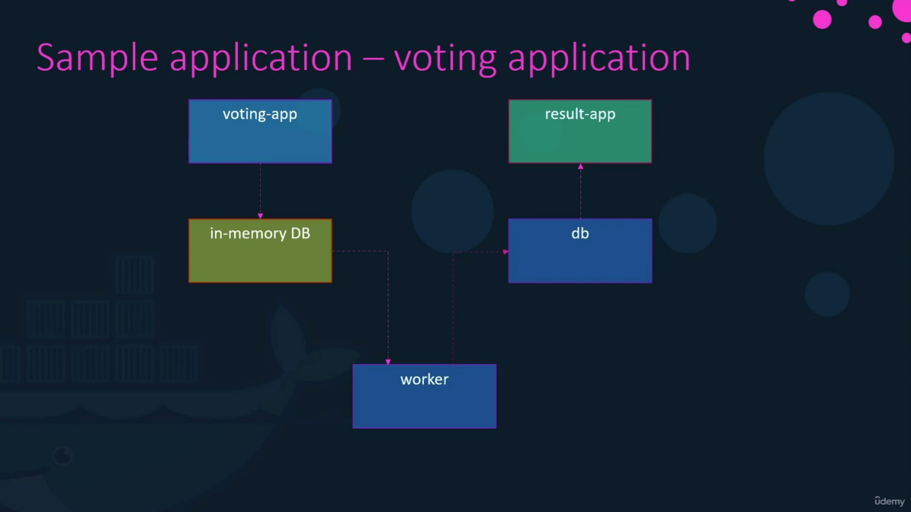

# Microservices Application - 

  

<br>

- For this particular example and demonstration, we are going to use a simple application developed by Docker to demonstrate the various features available in running an application stack on docker. So let's first get familiarized with the application  because we will be working with the same application in different sections throughout the demonstration.

- This is a sample voting application which provides an interface for user to vote and another interface to show the results. The application consists of various components such as the voting app, which is a web application developed in python to provide user with an interface to choose b/w two options `A` and `B`. When we make a selection the vote is stored in Redis. For those who are new to Redis, Redis in this case serves as a database in memory. This vote is than processed by the worker, which is an application written in `.NET`. The Worker application takes the new vote and updates the persistent database which is a `PostgreSQL` in our case. The PostgreSQL simply has a table with a number of votes for each category. In this case, it increments the number of votes for either of them depending on which option user chooses to vote for. Finally the result of the vote is displayed in a web-interface which is another web application developed in Node.js. This resulting application reads the count of votes from the database and displays it to the user.

  

- So, let's now plan out what are the goals that we need to accomplish while setting up Microservices based Application with Kubernetes.

- Following are the Goals:

  - Deploying Containers
  - Enable Connectivity
  - External Access

- As we are aware of the fact that the smallest Kubernetes object that we can create is a POD. So, we must first deploy these applications as a POD  on our Kubernetes Cluster.

- For the sake of simplicity, we will stick with PODs. So, once the PODs are deployed, the next step is to enable connectivity b/w services. So, it's important to know connectivity requirements are. So we must be very clear about what application requires access to what services. We know that the redis database is accessed by the application is accessed by the voting app and the worker app. The Voting app sends the vote to the Redis Database and the Worker app reads the data from the redis database. The PostgreSQL database is accessed by the worker app to update it with the total count of votes and than it is further accessed by the result app to read the total count of votes to be displayed in the resulting page in the broeser. So we know that the voting app is accessed by the external users, the voters, and the result app is also accessed by the external users to view the results. So most of the components are being accessed by another component except for the worker app. Note that the worker app is not being accessed by anyone.

- Now we learned that a service can be used to expose an application to other applications or users for external access. So we will create a service for the each and every PODs to connect them to each other.

</strong>


# Ingress Controller

## What is Ingress ??

>[!IMPORTANT]
>Ingress exposes HTTP and HTTPS routes from outside the cluster to services within the cluster. Traffic routing is controlled by rules defined on the Ingress resource.

- It makes your HTTP (or HTTPS) network service available using a protocol-aware configuration mechanism, that understands web concepts like URIs, hostnames, paths, and more. The Ingress concept lets you map traffic to different backends based on rules you define via the Kubernetes API.

  Example:

  ```mermaid
  graph LR;
    client([client])-. Ingress-managed <br> load balancer .->ingress[Ingress];
    ingress-->|routing rule|service[Service];
    subgraph cluster
    ingress;
    service-->pod1[Pod];
    service-->pod2[Pod];
    end
    classDef plain fill:#ddd,stroke:#fff,stroke-width:4px,color:#000;
    classDef k8s fill:#326ce5,stroke:#fff,stroke-width:4px,color:#fff;
    classDef cluster fill:#fff,stroke:#bbb,stroke-width:2px,color:#326ce5;
    class ingress,service,pod1,pod2 k8s;
    class client plain;
    class cluster cluster;
  ```

- An Ingress may be configured to give Services externally-reachable URLs, load balance traffic, terminate SSL / TLS, and offer name-based virtual hosting.

- An Ingress controller is responsible for fulfilling the Ingress, usually with a load balancer, though it may also configure your edge router or additional frontends to help handle the traffic.

- An Ingress does not expose arbitrary ports or protocols.

- Exposing services other than HTTP and HTTPS to the internet typically uses a service of type `Service.Type=NodePort` or `Service.Type=LoadBalancer`.

- A minimal Ingress resource example:

  ```yaml
  apiVersion: networking.k8s.io/v1
  kind: Ingress
  metadata:
    name: minimal-ingress
    annotations:
      nginx.ingress.kubernetes.io/rewrite-target: /
  spec:
    ingressClassName: nginx-example
    rules:
    - http:
        paths:
        - path: /testpath
          pathType: Prefix
          backend:
            service:
              name: test
              port:
                number: 80
  ```

- An Ingress needs `apiVersion`, `kind`, `metadata` and `spec` fields. The name of an Ingress object must be a valid DNS subdomain name.

- The Ingress spec has all the information needed to configure a load balancer or proxy server. 

### Ingress Rules

- Each HTTP rule contains the following information:

  - An optional host. In this example, no host is specified, so the rule applies to all inbound HTTP traffic through the IP address specified. If a host is provided (for example, foo.bar.com), the rules apply to that host.

  - A list of paths (for example, /testpath), each of which has an associated backend defined with a service.name and a service.port.name or service.port.number. Both the host and path must match the content of an incoming request before the load balancer directs traffic to the referenced Service.
  
  - A backend is a combination of Service and port names as described in the Service doc or a custom resource backend by way of a CRD. HTTP (and HTTPS) requests to the Ingress that match the host and path of the rule are sent to the listed backend.

- **Ingress Class**

  - Ingresses can be implemented by different controllers, often with different configuration.
  - Each Ingress should specify a class, a reference to an IngressClass resource that contains additional configuration including the name of the controller that should implement the class.

    ```yaml
    apiVersion: networking.k8s.io/v1
    kind: IngressClass
    metadata:
      name: external-lb
    spec:
      controller: example.com/ingress-controller
      parameters:
        apiGroup: k8s.example.com
        kind: IngressParameters
        name: external-lb
    ```

  - The `.spec.parameters` field of an `IngressClass` lets you reference another resource that provides configuration related to that `IngressClass`.

  The specific type of parameters to use depends on the ingress controller that you specify in the `.spec.controller` field of the `IngressClass`.

## Types of Ingress

### Ingress backed by Single Service

- There are existing Kubernetes concepts that allow you to expose a single Service (see alternatives). You can also do this with an Ingress by specifying a default backend with no rules.

  ```yaml
  apiVersion: networking.k8s.io/v1
  kind: Ingress
  metadata:
    name: single-service-ingress
  spec:
    defaultBackend:
      service:
        name: test
        port:
          number: 80
  ```

  If you create it using `kubectl apply -f` you should be able to view the state of the Ingress you added.

  ```bash
  kubectl get ingress test-ingress
  ```

  ```bash
  NAME           CLASS         HOSTS   ADDRESS         PORTS   AGE
  test-ingress   external-lb   *       203.0.113.123   80      59s
  ```

  Where 203.0.113.123 is the IP allocated by the Ingress controller to satisfy this Ingress.

### Simple Fanout

- A fanout configuration routes traffic from a single IP address to more than one Service, based on the HTTP URI being requested.

- An Ingress allows you to keep the number of load balancers down to a minimum. For example, a setup like:

  ```mermaid
  graph LR;
  client([client])-. Ingress-managed <br> load balancer .->ingress[Ingress, 178.91.123.132];
  ingress-->|/foo|service1[Service service1:4200];
  ingress-->|/bar|service2[Service service2:8080];
  subgraph cluster
  ingress;
  service1-->pod1[Pod];
  service1-->pod2[Pod];
  service2-->pod3[Pod];
  service2-->pod4[Pod];
  end
  classDef plain fill:#ddd,stroke:#fff,stroke-width:4px,color:#000;
  classDef k8s fill:#326ce5,stroke:#fff,stroke-width:4px,color:#fff;
  classDef cluster fill:#fff,stroke:#bbb,stroke-width:2px,color:#326ce5;
  class ingress,service1,service2,pod1,pod2,pod3,pod4 k8s;
  class client plain;
  class cluster cluster;
  ```

  <br/>

  ```yaml
  apiVersion: networking.k8s.io/v1
  kind: Ingress
  metadata:
    name: simple-fanout-example
  spec:
    rules:
    - host: foo.bar.com
      http:
        paths:
        - path: /foo
          pathType: Prefix
          backend:
            service:
              name: service1
              port:
                number: 4200
        - path: /bar
          pathType: Prefix
          backend:
            service:
              name: service2
              port:
                number: 8080

  ```

  When you create the Ingress with `kubectl apply -f`:

  ```bash
  kubectl describe ingress simple-fanout-example
  ```

  ```bash
  Name:             simple-fanout-example
  Namespace:        default
  Address:          178.91.123.132
  Default backend:  default-http-backend:80 (10.8.2.3:8080)
  Rules:
    Host         Path  Backends
    ----         ----  --------
    foo.bar.com
                /foo   service1:4200 (10.8.0.90:4200)
                /bar   service2:8080 (10.8.0.91:8080)
  Events:
    Type     Reason  Age                From                     Message
    ----     ------  ----               ----                     -------
    Normal   ADD     22s                loadbalancer-controller  default/test

  ```

### Name-based Virtual Hosting

- Name-based virtual hosts support routing HTTP traffic to multiple host names at the same IP address.

  ```mermaid
  graph LR;
  client([client])-. Ingress-managed <br> load balancer .->ingress[Ingress, 178.91.123.132];
  ingress-->|Host: foo.bar.com|service1[Service service1:80];
  ingress-->|Host: bar.foo.com|service2[Service service2:80];
  subgraph cluster
  ingress;
  service1-->pod1[Pod];
  service1-->pod2[Pod];
  service2-->pod3[Pod];
  service2-->pod4[Pod];
  end
  classDef plain fill:#ddd,stroke:#fff,stroke-width:4px,color:#000;
  classDef k8s fill:#326ce5,stroke:#fff,stroke-width:4px,color:#fff;
  classDef cluster fill:#fff,stroke:#bbb,stroke-width:2px,color:#326ce5;
  class ingress,service1,service2,pod1,pod2,pod3,pod4 k8s;
  class client plain;
  class cluster cluster;
  ```

  ```yaml
  apiVersion: networking.k8s.io/v1
  kind: Ingress
  metadata:
    name: name-virtual-host-ingress
  spec:
    rules:
    - host: foo.bar.com
      http:
        paths:
        - pathType: Prefix
          path: "/"
          backend:
            service:
              name: service1
              port:
                number: 80
    - host: bar.foo.com
      http:
        paths:
        - pathType: Prefix
          path: "/"
          backend:
            service:
              name: service2
              port:
                number: 80
  ```

- If you create an Ingress resource without any hosts defined in the rules, then any web traffic to the IP address of your Ingress controller can be matched without a name based virtual host being required.

  For example, the following Ingress routes traffic requested for `first.bar.com` to `service1`, `second.bar.com` to `service2`, and any traffic whose request host header doesn't match `first.bar.com` and `second.bar.com` to `service3`.

  ```yaml
  apiVersion: networking.k8s.io/v1
  kind: Ingress
  metadata:
    name: name-virtual-host-ingress-no-third-host
  spec:
    rules:
    - host: first.bar.com
      http:
        paths:
        - pathType: Prefix
          path: "/"
          backend:
            service:
              name: service1
              port:
                number: 80
    - host: second.bar.com
      http:
        paths:
        - pathType: Prefix
          path: "/"
          backend:
            service:
              name: service2
              port:
                number: 80
    - http:
        paths:
        - pathType: Prefix
          path: "/"
          backend:
            service:
              name: service3
              port:
                number: 80
  ```

### TLS

- You can secure an Ingress by specifying a Secret that contains a TLS private key and certificate. 

- The Ingress resource only supports a single TLS port, 443, and assumes TLS termination at the ingress point (traffic to the Service and its Pods is in plaintext).

- If the TLS configuration section in an Ingress specifies different hosts, they are multiplexed on the same port according to the hostname specified through the SNI TLS extension (provided the Ingress controller supports SNI).

- The TLS secret must contain keys named `tls.crt` and `tls.key` that contain the certificate and private key to use for TLS. For example:

  ```yaml
  apiVersion: v1
  kind: Secret
  metadata:
    name: testsecret-tls
    namespace: default
  data:
    tls.crt: base64 encoded cert
    tls.key: base64 encoded key
  type: kubernetes.io/tls
  ```
