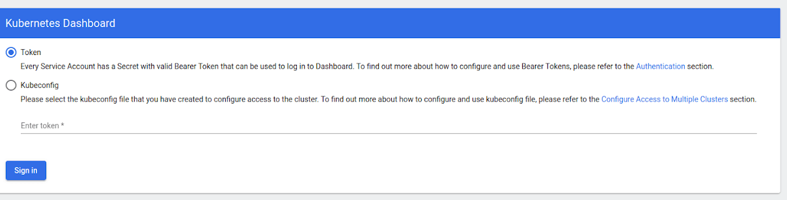

# Kubernetes Dashbaord


## Setting up the Kubernetes Dashboard

>[!IMPORTANT]
>The Kubernetes Dashboard is a web-based user interface for Kubernetes clusters. It allows users to manage applications running in the cluster and troubleshoot them, as well as manage the cluster itself.

- To set up the Kubernetes Dashboard, you need to deploy the dashboard pod and service in your cluster. You can do this by running the following command:

On most Kubernetes distributions, you can install the Dashboard with a simple kubectl command:

```bash
kubectl apply -f https://raw.githubusercontent.com/kubernetes/dashboard/v2.7.0/aio/deploy/recommended.yaml
```

After installing the Dashboard, enable access to it by running:

```bash
kubectl proxy
```

This starts a proxy server on port 8001 of your local machine.

Finally, to view the Dashboard, open a Web browser on the node where you started the proxy server and navigate to the following URL: `http://localhost:8001/api/v1/namespaces/kubernetes-dashboard/services/https:kubernetes-dashboard:/proxy`

## Accessing the Kubernetes Dashboard

When you log into the Dashboard for the first time, you'll be prompted for an access token, as in this screenshot.



To generate the token, we need to complete a few extra steps:

- First, create a file named `dashboard-adminuser.yaml` and enter the following code into it:

  `dashboard-adminuser.yaml`

  ```yaml
  apiVersion: v1
  kind: ServiceAccount
  metadata:
    name: admin-user
    namespace: kubernetes-dashboard  
  ```

- Be sure to save the file. Next, create another file named `dashboard-clusterrolebinding.yaml` and enter the following into it:

  `dashboard-clusterrolebinding.yaml`

  ```yaml
    apiVersion: rbac.authorization.k8s.io/v1
    kind: ClusterRoleBinding
    metadata:
        name: admin-user
    roleRef:
        apiGroup: rbac.authorization.k8s.io
        kind: ClusterRole
        name: cluster-admin
    subjects:
      - kind: ServiceAccount
        name: admin-user
        namespace: kubernetes-dashboard
  ```

- Save that file as well. Then, run these commands to apply the two manifests you just created:

    ```bash
    kubectl apply -f dashboard-adminuser.yaml
    kubectl apply -f dashboard-clusterrolebinding.yaml
    ```

- Finally, run the following command to generate a token:

  ```bash
  kubectl -n kubernetes-dashboard create token admin-user
  ```

  You would see an output like this:

  

  - Copy that code, paste it into the login screen for the Kubernetes Dashboard, and click the Sign in button.

- After logging in, you'll see a screen like the following:

  

# Kubernetes Namespaces

## What is a Kubernetes Namespace?

>[!IMPORTANT]
>Namespaces are a way to divide cluster resources between multiple users or teams. They are a way to organize and isolate resources within a cluster.

- In Kubernetes, we organize resources using namespaces. We can have multiple namespaces in a single cluster, and each namespace can have its own resources.

- Think of namespace as a virtual cluster inside a physical cluster.

- By default, when you create a Kubernetes cluster, it comes with four namespaces: `default`, `kube-system`, `kube-public` and `kube-node-lease`.

- `kubernetes-dashboard` namespace is shipped automatically when you install `minikube`, so it's specific to `minikube`. It's not part of the standard cluster.

- `kube-system`

  - It is the namespace where all the system pods are running. These are the pods that are required for the cluster to function properly.

  - And, is not at all meant for users use.

  - >[!CAUTION]
    >It is not advised to create or modify anything in `kube-system` namespace.

  - The components that are deployed in the `kube-system` namespace are system processes that are required for the cluster to function properly which include master or kubectl managing processes.
  
- `kube-public`

  - `kube-public` namespace contains the publically accessible data, this include ConfigMaps.

- `kube-node-lease`

  - `kube-node-lease` namespace is used to determine the availability of nodes in the cluster.

  - It is a recent addition to Kubernetes.

  - It hold information about the heartbeats of the nodes, each node gets its own lease object that contains the information about the availability of the node.

- `default`

  - `default` namespace is the namespace where all the resources are created by default.

  - If you don't specify a namespace while creating a resource, it will be created in the `default` namespace.

## Creating a Namespace

- To create a namespace, you can use the following command:

  ```bash
  kubectl create namespace <namespace-name>
  ```

  For example, to create a namespace named `my-namespace`, you can run:

  ```bash
  kubectl create namespace my-namespace
  ```

- To list all the namespaces in your cluster, you can run:

  ```bash
  kubectl get namespaces
  ```

  This will list all the namespaces in your cluster.

- Another way to create a namespace is by using a YAML file. You can create a YAML file with the following content:

  `my-namespace.yaml`

  ```yaml
  apiVersion: v1
  kind: Namespace
  metadata:
    name: my-namespace
  ```

  And then apply the YAML file using the following command:

  ```bash
  kubectl apply -f my-namespace.yaml
  ```

  This will create a namespace named `my-namespace`.

## Need for Namespaces

- The need for a personal or custom namespace arises when you want to isolate your resources from other resources in the cluster. Let's say we have only the `default` namespace and we create all our resources on the same namespace. This will lead to a lot of confusion and chaos.

  If we have a complex application that has multiple deployments which creates replicas of many pods and we have resources like services and ConfigMaps etc.. very soon the `default` namespace will be cluttered with different components of the application, and will make it diffcult to have an overview of what's in there specially when we have multiple users creating stuff inside.

  So, A best practice is to create a namespace for each application or for each team or individual, so that the resources are isolated and can be managed easily.

  

  >[!TIP]
  >Namespaces should not be used for smaller projects. Or if you have less than 10 users as per the K8s documentation.

<hr/>

## Points to Remember

>[!IMPORTANT]
>You can't access most of the resources from another namespace. Let's say we have a ConfigMap, Secrets in Project A namespace that references the database in Database service.<br/><br/>We can't use that ConfigMap and Secrets in Project B. And hence, we need to create the same ConfigMap in Project B namespace as well.<br/><br/><strong>Each Namespace must define it's own `ConfigMap` and `Secrets`.</strong>

>[!NOTE]
>However the resource that we can share across namespaces are `Services` and `Ingress`.<br/><br/>So, ConfigMap in Project B namespace references the database service that will eventually be used in a POD.

>[!WARNING]
>There are some resources that are cluster-wide and are not namespaced. They live globally in the cluster. And, you can't isolate them in a certain namespace. Examples are `PersistentVolumes`, `StorageClasses`, `Nodes`, `ClusterRoles`, `ClusterRoleBindings`, `CustomResourceDefinitions`, etc.