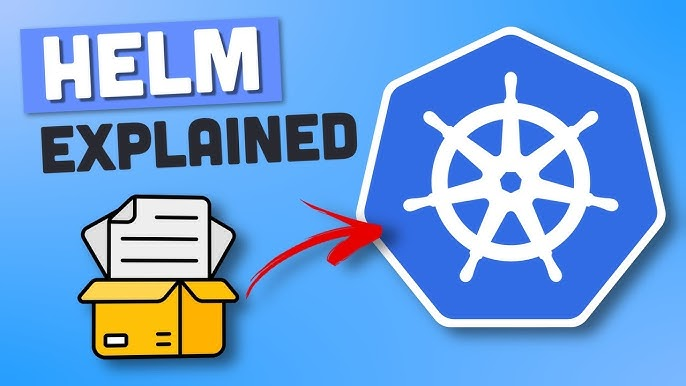

# Getting started with Helm



>[!IMPORTANT]
>`Helm` is a `package manager for Kubernetes` that allows you to define, install, and manage applications on your Kubernetes cluster. Helm packages are called charts, and they contain all the Kubernetes resources needed to run an application, such as deployments, services, and ingress rules.

- So, it's a convinient way for packaging collections of Kubernetes yaml files, and distributing them in public and private repositories/regisitries.

- Let's say we have deployed our application in kubernetes cluster, and you want to deploy Elastic Stack additionally in your cluster that our application will use to collect it's logs.

  In order to deploy Elastic Stack, in your kubernetes cluster, we will need a couple of Kubernetes Components, we will need a statefulset which is meant for stateful applications, a ConfigMap for external configuration, A Secret for credential storage and K8s user with respective permissions and also create couple of services.

  Now, if we were to create all these files manually by searching for each one of them or doing own brain work would be a tedious task.

  So, it makes complete sense that someone created all these yaml files packaged them and published them over onto a public repository/regisitry for people to use.

  And these bundle of yaml files are called `Charts` in Helm or `Helm Charts`.

>[!NOTE]
>A Helm chart is a package that contains all the resources required to deploy an application to a Kubernetes cluster.

- Commonly used deployment like Database applications, elasticsearch or MongoDB, MySQL or monitoring applications like Prometheus, Grafana that have kind of complex setup all have charts available in some Helm Repository.

- Using the command:

  ```bash
  helm install <chart-name> <release-name>
  ```

  we can reuse the configuration that someone else has already made without additional effort and deploy the application in our cluster.

  We can look for the Charts using the command:

  ```bash
  helm search repo <chart-name>
  ```

>[!NOTE]
>Another functionality of `Helm` is it's also a templating engine.

- Imagine you have an application made up of multiple microservices, and I am deploying all of them in my k8s cluster, and deployment and services of each of those microservices are pretty much the same with only difference that the application name and the version name are different or docker image name and version tags are different.

  So, without helm you will write separate yaml files, configuration files for each of those microservices, so you would have multiple deployment service files, where each has it's own application name and version defined.

  Using Helm, what we can do is we can define a common blueprint for all those services, the values that are dynamic or are going to be changed replaced by placeholders. And, that would be a template file.

  And, would look something like this:

  ```yaml
  appVersion: v1
  kind: Pod
  metadata:
    name: {{ .Values.appName }}
  spec:
    containers:
      - name: {{ .Values.appName }}
        image: {{ .Values.image }}
        ports:
          - containerPort: 80
  ```

  Here, one can clearly say that instead of values in some places, we have the syntax which means that we are taking a value from external configuration.

  And, if you see carefully there's something called `Values` which is a special object in Helm that allows you to pass values to the template file.

  These Values are defined in `values.yaml` file.

  `Values.yaml`

  ```yaml
  name: my-app
  container: my-app-image:v1
    name: my-app
    image: my-app-image:v1
    port: 80
  ```

  `.Values` is a special object that's been created based on the values that are supplied via `values.yaml` file or via CLI using `--set` flag.

  So, which ever way you define them these values are put together in `.Values` object that you can than use in those template files to get the values out.

- So, now instead of having YAML files for each microservice or application, we just have one and we can just simply replace those values. It is practically beneficial when you are using CI/CD pipelines.

  Cause there in the build files, we can replace the values in those template yaml files on the fly and deploy them in the cluster.

- Another, use case for Helm comes into picture when we deploy the same application across different environments from k8s cluster.
  
- So, consider that you have a microservice application that we want to deploy on development, staging and production clusters.

- So, instead of deploying individual `YAML` files separately in each cluster, we can package them up to make our own application chart that will have all the necessary `yaml` files that particular deployment needs, and than we can use them to redeploy the same application in different k8s cluster environments using 1 command, which will also make the whole deployment process easier.
  
  ```bash
  >> ls -a
  >> values.yaml    Chart.yaml    charts/    templates/
  ```

- So, this is how the folder structure of a chart generally looks like:
  
- Top level is the name of the chart or the Chart Folder.

- `Chart.yaml` is the file that contains all the meta information about the chart could be name, version, dependencies etc...

- `values.yaml` is the place where all the values are configured for the template files, and these are the default values that we can override later.

- `chart/` folder have the chart dependencies inside meaning that if this chart depends on other charts then those chart dependencies will be stored here.

- `templates/` folder is basically where the template files are stored.

- So, when we execute `helm install <chartname>` command to actually install those yaml files into k8s, the template files from here will be filled with the values from `values.yaml` producing valid k8s manifest that can than be deployed into k8s.
  
- Another feature of Helm is release management, which is provided based on it's setup.
  
- But it's important to note here the difference b/w Helm Version 2 vs 3.
  
  - In Version 2 of Helm, the installation comes in 2 parts. We have the `helm client` and `helm server`. The Server part is called `tiller`.

  - So, whenever we deploy helm chart using `helm install <chart-name>`.

    >[!NOTE]
    >Helm client will send the yaml files to tiller that actually runs in a kubernetes cluster. And tiller than executes these request and create components from these yaml files inside the k8s cluster.<br/><br/>And exactly, this architecture offers additional valuable features of Helm which is `release management`.


    ```mermaid
    sequenceDiagram
    participant User as User
    participant HelmClient as Helm Client
    participant Tiller as Helm Server (Tiller)
    participant K8sCluster as Kubernetes Cluster

    User->>HelmClient: Runs Helm commands (e.g., helm install)
    HelmClient->>HelmClient: Packages Charts and Dependencies
    HelmClient->>Tiller: Sends request (chart and config)
    Tiller->>K8sCluster: Interacts with Kubernetes API to deploy resources
    K8sCluster->>Tiller: Returns deployment status
    Tiller->>HelmClient: Sends deployment status/results
    HelmClient->>User: Displays output and status
    ```

    - The way Helm Client-Server setup works is that whenever you create or change deployment `tiller` will store a copy of each configuration client send for future reference, thus creating a history of chart executions.

      So, when you execute `helm upgrade <chart-name>` the changes will be applied to existing deployment, instead of removing the existing and creating a new one.

      In case, if any upgrade goes wrong or fails we can rollback the update using the command:

      ```bash
      helm rollback <chart-name>
      ```

      All, this is possible because of the Chart Execution History that tiller keeps whenever we send those requests from Helm Client to tiller.

- **Downside of Helm Server(Tiller)**
  
  Tiller has too much power inside a k8s cluster. It can perform `CRUD` operations on the components, and has too much permissions, and this makes it a big security threat. And, this is the reason why in Helm 3, tiller was removed and was made just a simple helm binary.

### How values are injected into YAML files

- Consider that in `values.yaml` which is default value configuration we have following 3 values, the `imageName`, `port` and `version`.
  
  ```yaml
  imageName: myapp
  port: 8080
  version: 1.0.0
  ```
  
  So, the default value mentioned here can be overwritten in couple of different ways.
  
  - One way is when executing `helm install` command specify the alternate `values-1.yaml` files as follows using `--values` flag:

  `values-1.yaml`

  ```yaml
  version: 0.9.7
  ```

  ```bash
  helm install --values=values-1.yaml <chartname>
  ```

  This will produce a new `.Values` object that would look something like this:

  ```yaml
  imageName: myapp
  port: 8080
  version: 0.9.7
  ```

 So, it would have `imageName` and `port` from `values.yaml` and the one we overrode from `values-1.yaml` file.

- Alternatively, we can also provide additional individual values using `--set` flag where we can define values directly on the command line. But, it's more organized and better manageable to have file `values.yaml` files where we store all those values.
  
  ```bash
  helm install --set version=2.0.0
  ```
