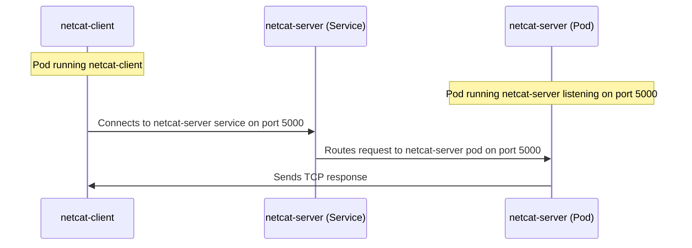

# TCP Communication using `netcat` in 

- This is a Proof of Concept (POC) project to demonstrate how to create a simple TCP server and client in Kubernetes using `netcat`. You can utilise this Idea, and maybe try out using Kong API Gateway to route the TCP traffic.

- In this project, we will create a simple TCP server and client in 2 different pods using `netcat` in Kubernetes, and communicate between them.



- We will use `netcat` to create a TCP server and client.

- `netcat` is a simple Unix utility which reads and writes data across network connections using the TCP/IP protocol. It is also known as `nc`.

- We will create a TCP server in one pod and a TCP client in another pod.

- The TCP client will connect to the TCP server using the service IP and port. The service will route the request to the TCP server pod.

- `deployment.yaml`

    ```yaml
    # This section contains the deployment configuration for the netcat server.

    # The netcat server listens on port 5000 and is configured to use 128Mi of memory and 500m of CPU.

    apiVersion: apps/v1
    kind: Deployment
    metadata:
    name: netcat-server
    spec:
    selector:
        matchLabels:
        app: netcat-server
        template:
        metadata:
            labels:
            app: netcat-server
        spec:
            containers:
            - name: netcat-server
            image: subfuzion/netcat # netcat image
            command:
            - sh
            args:
            - -c
            - "nc -l 5000" # listen on port 5000
            resources:
                limits:
                memory: "128Mi"
                cpu: "500m"
                ports:
                - containerPort: 5000 # expose port 5000
    ---
    # This section contains the deployment configuration for the netcat client.

    # The netcat server listens on port 5000 and is configured to use 128Mi of memory and 500m of CPU.

    apiVersion: apps/v1
    kind: Deployment
    metadata:
    name: netcat-client
    spec:
    selector:
        matchLabels:
        app: netcat-client
        template:
        metadata:
            labels:
            app: netcat-client
        spec:
            containers:
            - name: netcat-client
            image: subfuzion/netcat # netcat image
            command:
            - sh
            args:
            - -c
            - "while true; do sleep 3600; done" # keep the pod running
            resources:
                limits:
                memory: "128Mi"
                cpu: "500m"
    ```

  Code Explanation:

  - We have defined two deployments, one for the netcat server and one for the netcat client.

  - The netcat server listens on port 5000 using the command `nc -l 5000`.

  - The netcat client is configured to keep running using the command `while true; do sleep 3600; done`.

  - The client will connect to the server using the service IP and port.

  - The server will get the IP of the client by checking the source IP of the incoming connection or request. The server can then send a response to the client.

- `service.yaml`

    ```yaml
    # Create a service to expose the netcat-server deployment

    apiVersion: v1
    kind: Service
    metadata:
    name: netcat-server # service name
    spec:
    selector:
        app: netcat-server # select the netcat-server deployment
    ports:
    - port: 5000 # expose port 5000
        targetPort: 5000 # route traffic to port 5000
    ```

- Once done use the following commands to deploy the server and client:

    ```bash
    kubectl apply -f deployment.yaml
    kubectl apply -f service.yaml
    ```

- In order to send a message from the client to the server, we need to exec into the client pod and use `netcat` to send a message to the server.

  Use the command:

  ```bash
  kubectl exec -it <netcat-client-XXXXXXXXX> -- nc netcat-server 5000
  ```

  

- You can check the status of the pods using the following command:

    ```bash
    kubectl get pods
    ```

  Use the following command to get the logs of the netcat server pod:

    ```bash
    kubectl logs -f <netcat-server-pod-name>
    ```

  

- I am trying to implement TCP Ingress via Kong API Gateway on both static and dynamic ports, and the same for TCP Egress as well.
